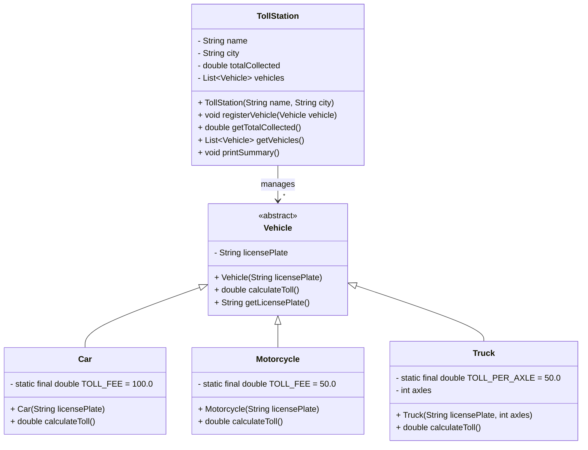

# Toll System

## 📜 Description
The system consists of:
- **TollStation**: Manages vehicles and calculates toll fees.
- **Vehicle (abstract class)**: Represents any vehicle entering the toll station.
- **Car**: Pays a fixed toll fee of $100.
- **Motorcycle**: Pays a fixed toll fee of $50.
- **Truck**: Pays a toll fee based on the number of axles ($50 per axle).

## 📌 Features
- Register vehicles at a toll station.
- Calculate toll fees based on vehicle type.
- Maintain a log of vehicles that have passed through.
- Display a summary of collected tolls.

## 🚀 Getting Started

### Prerequisites
- Java 21
- JUnit 5 (for testing)

### Installation
Clone the repository and navigate to the project directory:
```sh
git clone <repository_url>
cd toll-system
```

### Running the Application
Compile and run the Java application:
```sh
javac TollSystem.java
java TollSystem
```

### Running Tests
Run the unit tests using JUnit:
```sh
mvn test
```

## 🛠️ Testing
The project includes unit tests covering:
- Toll calculations for each vehicle type.
- Total toll collection at the toll station.
- Vehicle registration.

  ## 🏗️ UML Class Diagram


## 📄 License
This project is licensed under the MIT License.
